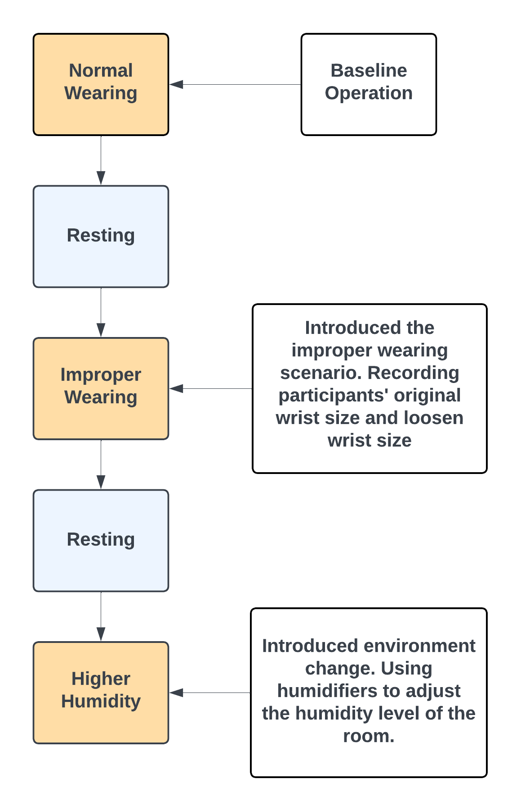
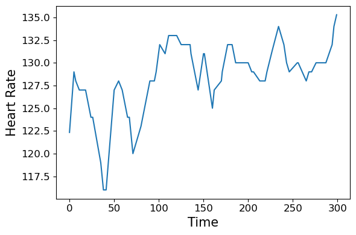

## 📌 Project Overview
This project investigates how real-world factors affect the integrity of wearable health data and develops anomaly detection frameworks to identify data compromises.  
We designed two sequential experiments:  
1. **Experiment 1 (IDETC-CIE 2024):** Focused on human-related (improper wearing) and environmental-related (humidity) factors. Introduced a Gramian Angular Field (GAF)-based anomaly detection framework.  
2. **Experiment 2 (IEEE):** Extended to include a technical factor (unstable network), with more participants and more data collected. Compared a hybrid autoencoder model against an LLM-based GPT-2 embedding pipeline.  

Together, these studies highlight how **human-related, environmental-related, and technical contexts** can undermine wearable device data quality — and how anomaly detection models can safeguard health monitoring.

## 📖 Background & Research Motivation
- **Why integrity matters:** Remote health monitoring depends on reliable data. Inaccurate wearable data can cause misdiagnosis, undertreatment, or even patient harm.  
- **Gap in literature:** Prior research had explored improper wearing and environmental factors like humidity, but no study systematically integrated human-related, environmental-related, and technical factors in one framework.  
- **Model choice decisions:**  
  - Adopted GAF representation for Experiment 1 because literature showed its ability to transform 1D time series into 2D images that preserve temporal correlations, making anomalies more visible.  
  - Adopted Hybrid Autoencoder (CNN + LSTM + Attention) for Experiment 2 because prior anomaly detection work emphasized combining spatial + temporal features.  
  - Tested LLMs (GPT-2 embeddings) because emerging literature suggested LLMs can model sequential patterns when time series are serialized into tokens.  

---

## 🧪 Experiment 1: Human & Environmental Factors (ASME IDETC-CIE 2024)
- **Focus:** Improper Wearing (human-related) + Elevated Humidity (environmental-related).  
- **Experiment Design:**
  The experiment was conducted in person in the laboratory with participants wearing the Apple Watch. The entire session lasted 25 minutes and was divided into five 5-minute blocks (see Figure below).  
    1. **Normal Wearing (5 min):** Device worn correctly with guidance from the proctor. This served as the baseline condition.  
    2. **Resting (5 min):** Cool-down session to avoid carry-over effects.  
    3. **Test Condition 1 (5 min):** Either Improper Wearing (strap deliberately adjusted to be too loose/tight) or Elevated Humidity (room humidity increased to ~65%).  
    4. **Resting (5 min):** Another cool-down period.  
    5. **Test Condition 2 (5 min):** The second factor is not tested in Step 3 (randomized order).
  

  
   
  <em>Figure: Experiment 1 Procedure Flowchart</em>
  

  
### ⚙️ Proposed Multi-channel Framework (Experiment 1)
#### 1. Data Transformation Using GAF
- We transformed heart rate and 3D acceleration (x, y, z) into **image representations** using the **Gramian Angular Field (GAF)** method.  
- GAF encodes time series into polar coordinates:  
  - Angular dimension = time  
  - Radial dimension = data values  
- This transformation preserves temporal correlations — critical for anomaly detection in physiological signals.  
- We used Gramian Angular Summation Field (GASF), computed from cosine/sine outer products of the polar coordinates.  

<table>
<tr>
<td> <em>(a) HR data, normal condition</em></td>
<td> <em>(a) HR GAF image, normal condition</em></td>
</tr>
<tr>
<td> <em>(b) HR data, elevated humidity</em></td>
<td> <em>(b) HR GAF image, humidity</em></td>
</tr>
</table>

---

#### 2. Dimensionality Reduction with PCA
- Because motion data had **three channels** and could dominate the HR signal, we applied **Principal Component Analysis (PCA)** to the GAF motion images.  
- PCA distilled high-dimensional motion into its **principal components**, ensuring:  
  - More efficient computation  
  - Balanced representation between motion and heart rate  
- Decision rationale: literature on multivariate time series anomaly detection suggests PCA helps **avoid bias toward high-variance signals**.  

- 

---

#### 3. Anomaly Identification Using Autoencoder
- We trained a **convolutional autoencoder** on **baseline (normal) data**.  
- The autoencoder reconstructs GAF inputs → reconstruction error measures how well the test data fits the normal pattern.  
- High reconstruction error = anomaly.  

**Architecture highlights:**  
- Input: (224 × 224 × 2) images (HR + motion)  
- Encoder: 3 convolutional layers (32 filters, 3×3 kernel, ReLU activation)  
- Downsampling: MaxPooling (2×2)  
- Bottleneck: latent representation (forces compact feature learning)  
- Decoder: Upsampling layers + final Conv layer with sigmoid activation  
- Output: reconstructed image  

📊 Figure placeholder:  
- 

---

#### 4. Threshold Calculation (L2 Norm + MAD)
- **Why L2 norm?** Compared to MSE/MAE, the Euclidean distance better captured anomaly magnitude in the feature space.  
- **Why MAD?** Median Absolute Deviation is robust to outliers, yielding **stable thresholds** for noisy wearable data.  
- Final decision rule:  
  - Compute reconstruction error using L2 norm.  
  - Flag anomaly if > (median + k × MAD).  

📊 Figure placeholder:  
- 

---

✅ **Key innovation:**  
This framework combined **GAF (temporal-preserving representation)** + **PCA (dimensionality reduction)** + **Autoencoder (feature learning)** + **Robust thresholding (L2 + MAD)**.  
By training only on **normal data**, the model specialized in reconstructing baseline patterns, making **deviation due to improper wearing or humidity easy to detect**.
 

## 🧪 Experiment 2: Adding Technical Factors
- **Motivation:** The first experiment showed strong effects, but wearable devices also face **network-related technical issues**. We expanded the study with **more participants and more data points** to test this.  
- **Focus:** Improper Wearing (social) + Elevated Humidity (environmental) + **Unstable Network (technical)**.  
- **Data Collection:**  
  - Baseline: 8 hours.  
  - Controlled: 25 minutes with 5 segments (wearing, rest, unstable network, rest, humidity).  
- **Frameworks Compared:**  
  1. **Hybrid Autoencoder** (CNN + LSTM + Attention).  
  2. **LLM-based GPT-2 Pipeline**: PCA → tokenization → GPT-2 embeddings → anomaly scoring.
 
## 📊 Exploratory Data Analysis
