## 📌 Project Overview - Wearable Data Integrity & Anomaly Detection
This project aims to enhance the reliability and trustworthiness of wearable health monitoring systems by identifying anomalies in physiological data, including heart rate and motion signals. Two human-subject experiments were conducted to simulate real-world user scenarios. A benchmark framework was developed to evaluate anomaly detection models ranging from lightweight baselines to advanced neural networks and large language models (LLMs).
The work has led to three peer-reviewed publications. These findings highlight how anomaly detection can reduce false alerts, increase trust in health insights, and support the scalable use of wearables in telehealth, fitness, insurance, and safety-critical industries.

## 📖 Background & Research Motivation
Wearable devices, such as the Apple Watch and Fitbit, have become an integral part of daily life, enabling people to track their heart rate, sleep patterns, and activity levels. Yet, users often report false alerts (e.g., “abnormal heart rate” notifications while resting) or missing/incorrect data when the device is worn loosely, exposed to sweat/humidity, or suffers from poor connectivity. These errors undermine user trust and limit adoption in healthcare.

From a healthcare perspective, doctors hesitate to rely on consumer wearables for remote monitoring due to concerns about uncertain data integrity. A single false alarm can lead to unnecessary clinic visits or overlooked true emergencies. From an industry perspective, users cancel subscriptions when the app’s recommendations (e.g., calorie burn or training intensity) don’t match their actual effort due to faulty data.

This project was motivated by such real-world challenges. Our goal was to improve the reliability of wearable health data by detecting anomalies caused by human behavior, environmental factors, or technical issues, ensuring more accurate and trustworthy monitoring.

## 🧪 Benchmark, Metrics, and Experiment Design
### Evaluation Metric  
- **Reconstruction Error:** Difference between input data and model reconstruction.  
- Larger errors = stronger deviation from expected "normal" patterns.  
- Used as the primary anomaly detection metric.
- The reconstruction error for input $\mathbf{x}$ and its reconstruction $\hat{\mathbf{x}}$ is calculated as:

$$
E(\mathbf{x}) = \lVert \mathbf{x} - \hat{\mathbf{x}} \rVert^2_2 
= \sum_{i=1}^{n} (x_i - \hat{x}_i)^2
$$

### Baseline Model  
- **KitNet**: Lightweight ensemble of autoencoders, originally for network intrusion detection.  
- Strengths: Fast, unsupervised, suitable for small devices.  
- Limitations: Detected obvious anomalies but struggled with subtle changes and user variability, exposing a performance gap.  

### Experiment Design  
| Aspect | **First Experiment (Pilot)** | **Second Experiment (Expanded Study)** |
|--------|-------------------------------|-----------------------------------------|
| **Session Length** | 25 minutes total | Baseline: 8 hours (10 AM – 6 PM) Controlled: 25 minutes |
| **Conditions** | - Normal Wearing - Resting (control) - Improper Wearing (loose strap) | - Baseline: Daily activities (normal data) - Controlled: Five 5-min sessions  • Resting (×2, control)  • Improper Wearing  • Unstable Network  • Elevated Humidity |
| **Purpose** | Initial pilot to test feasibility | Expanded study with richer dataset for robust training and controlled evaluation |
| **Limitations** | Small training dataset | Broader dataset, addressing pilot limitation |
| **Outcome** | Identified need for larger dataset | Provided both baseline training data and controlled test conditions |

   

   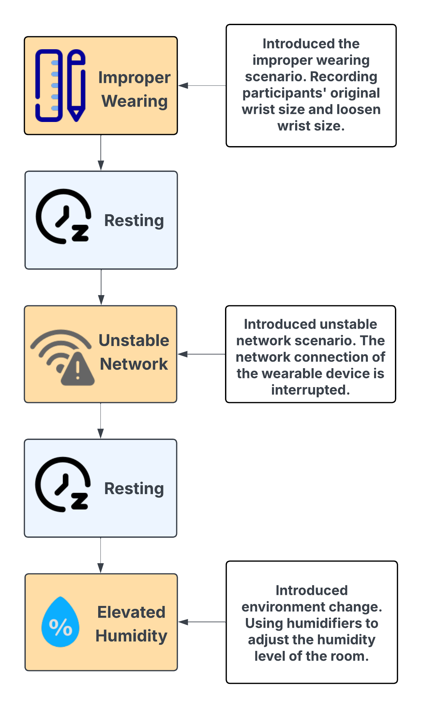
    
   <em>Figure 1: Second Experiment Controlled Session Procedure Flowchart</em>
   

## 📊 Data Processing & Feature Engineering
The raw dataset combined Apple Watch heart rate (7–8s intervals) and motion data (1s intervals). Steps included: 
- Synchronization of heart rate and motion timestamps.
- Interpolation to fill gaps in heart rate data.
- Feature Engineering: motion magnitude (via Euclidean norm), normalization (Min-Max scaling), and segmentation into time windows for training.
- Dimensionality Reduction
  - Challenge: Motion data had 3 axes (x, y, z) while heart rate had only 1 channel.  
    - Initial autoencoder tests showed poor results — the model overfit to motion data and ignored subtle heart rate variations.  
  - Diagnosis: The imbalance of **3 motion features vs. 1 heart rate feature** skewed the learning process.  
  - Solution: Apply **Principal Component Analysis (PCA)** on the motion data.  
    - Reduced the 3D motion signals into 1 principal component capturing the dominant variance.  
    - Balanced the input space into **two channels.  
  - Impact: 
    - Eliminated redundancy and noise from motion data.  
    - Ensured equal weighting of motion and heart rate inputs.  
    - Improved anomaly detection performance in the autoencoder and downstream LLM experiments.
   
Examples of normalized data segments:

  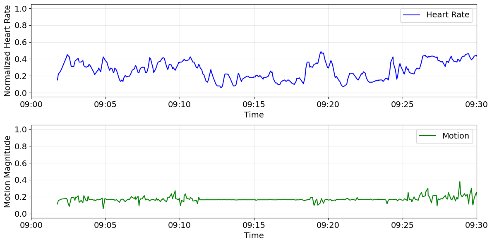
   
  <em>Figure 2. Example of Training Data Segment: Normalized heart rate and motion magnitude during baseline.</em>

  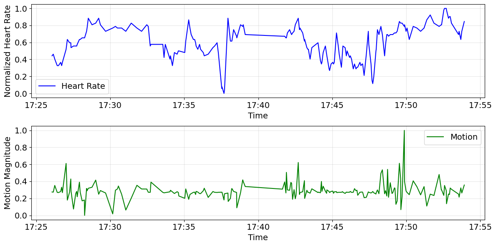
   
  <em>Figure 3. Example of Testing Data Segment: Normalized heart rate and motion magnitude during controlled conditions.</em>

 
## Model Development    
We tested and advanced multiple models:
| **Model**                                         | **Approach**                                                                | **Why Chosen**                                             | **Performance / Insights**                                                         |
| ------------------------------------------------- | --------------------------------------------------------------------------- | ---------------------------------------------------------- | ---------------------------------------------------------------------------------- |
| **KitNet (Baseline)**                             | Ensemble autoencoders measuring reconstruction error                        | Lightweight, unsupervised, established baseline            | Detected anomalies but limited on subtle/contextual changes                        |
| **Autoencoder + GAF**                             | Converted time-series into images (Gramian Angular Field) + CNN autoencoder | To leverage image-recognition power of CNNs                | Achieved **88.9% accuracy** for improper wearing, **100%** for humidity            |
| **Autoencoder + Attention (Hybrid ConvAE-ALSTM)** | CNN for spatial patterns + LSTM for temporal trends + Attention for context | To capture both short- and long-term dependencies          | Outperformed KitNet, robust to noisy data                                          |
| **LLM (GPT-2 embeddings)**                        | Transformed PCA features into text-like sequences, embedded via GPT-2       | Tested frontier method: treating time series as “language” | Promising interpretability, but sensitive to noise; less accurate than autoencoder |

---
### 🔧 Introduction to Autoencoders  

An autoencoder is a type of neural network designed to learn a compressed representation of data.  
It consists of two main parts:  
- **Encoder:** reduces the input into a compact latent representation (bottleneck).  
- **Decoder:** reconstructs the input from this compressed form.  

By training on *normal data only*, the autoencoder learns to reproduce expected patterns. When unusual conditions (e.g., improper wearing or high humidity) occur, the reconstruction becomes inaccurate, resulting in a **high reconstruction error**. This makes autoencoders especially powerful for anomaly detection in wearable signals, since anomalies naturally appear as poorly reconstructed patterns.  

### 🧩 Convolutional Autoencoder  
Convolutional Autoencoders are effective for image denoising, compression, and feature extraction because their convolutional nature preserves important spatial patterns, unlike fully connected autoencoders.

  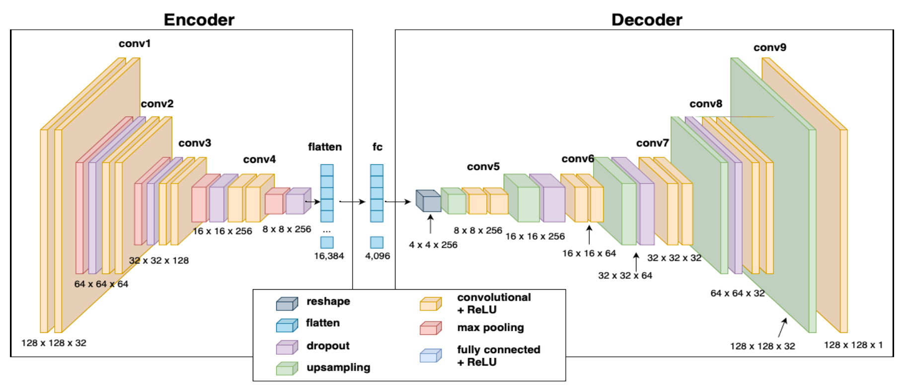
   
  <em>Figure 4. Structure of Convolutional Autoencoder.  
  Adapted from N. Kowalczyk, M. Sobotka, and J. Rumiński, 
  "Mask Detection and Classification in Thermal Face Images," 
  <em>IEEE Access</em>, vol. 11, pp. 43349–43359, 2023. 
  <a href="https://doi.org/10.1109/ACCESS.2023.3272214">https://doi.org/10.1109/ACCESS.2023.3272214</a>, 
  licensed under CC BY 4.0.</em>

**Challenge:** Small, noisy wearable datasets → models prone to overfitting.  
**Solution:** Hybrid ConvAE-ALSTM with Attention improved generalization, while PCA balanced HR vs. motion inputs.  

---

### 🔎 Model Choice Decisions    
- **Experiment 1 (Pilot):**  
  - Adopted **GAF transformation** + CNN autoencoder because literature showed that converting time-series into images preserves temporal correlations and highlights anomalies.  
- **Experiment 2 (Expanded):**  
  - Moved to **Hybrid ConvAE-ALSTM with Attention** to capture both **spatial features** (CNN) and **temporal dependencies** (LSTM) while focusing on salient signals (Attention).  
- **Exploration of LLMs:**  
  - Tested **GPT-2 embeddings** after PCA compression, inspired by emerging work treating time series as sequential “tokens” for LLMs.  
 
### 📈 Data Transformation Using GAF  
- We transformed heart rate and 3D acceleration (x, y, z) into **image representations** using the **Gramian Angular Field (GAF)** method.  
- GAF encodes time series into polar coordinates:  
  - Angular dimension = time  
  - Radial dimension = data values  
- This transformation preserves temporal correlations — critical for anomaly detection in physiological signals.  
- We used Gramian Angular Summation Field (GASF), computed from cosine/sine outer products of the polar coordinates.

<table>
<tr>
<td>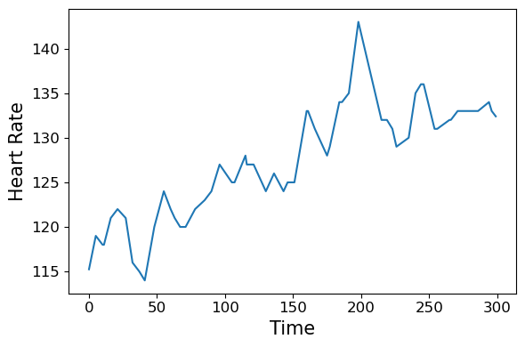 <em>(a1) HR data, normal condition</em></td>
<td>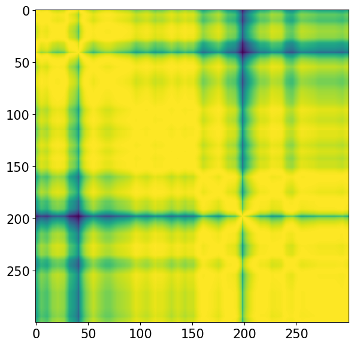 <em>(a2) HR GAF image, normal condition</em></td>
</tr>
<tr>
<td> <em>(b1) HR data, elevated humidity</em></td>
<td>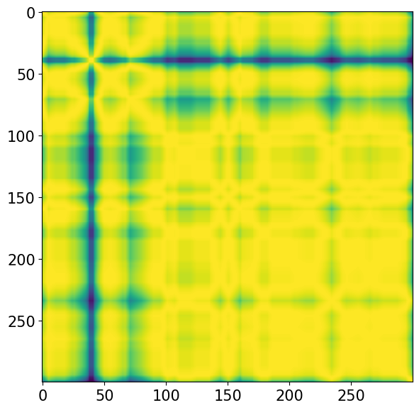 <em>(b2) HR GAF image, elevated humidity</em></td>
</tr>
<tr>
<td>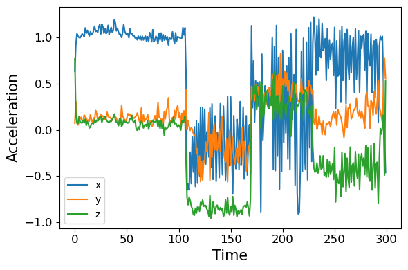 <em>(c1) Motion data, normal condition</em></td>
<td>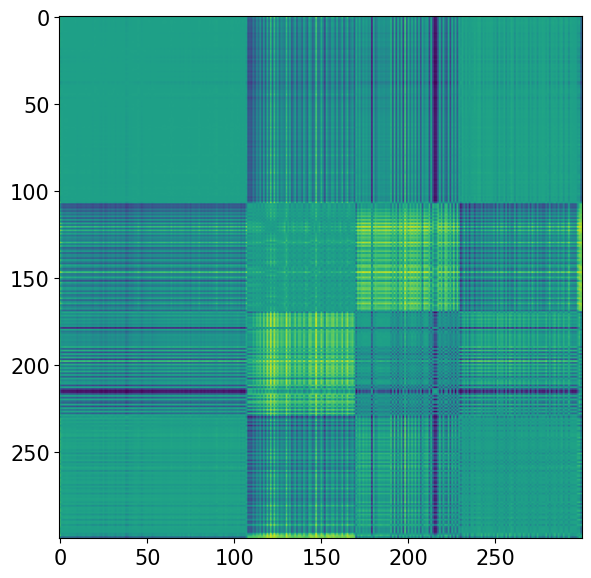 <em>(c2) Motion GAF image, normal condition</em></td>
</tr>
<tr>
<td>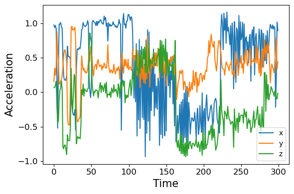 <em>(d1) Motion data, elevated humidity</em></td>
<td>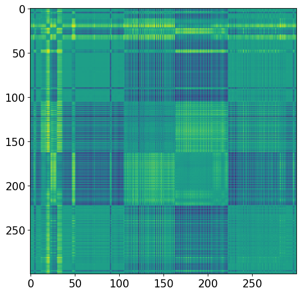 <em>(d2) Motion GAF image, elevated humidity</em></td>
</tr>
</table>

<em>Figure 4: GAF Transformation of Heart Rate and Motion Data</em>

---

## Insights & Future Plans

This project highlights:
In healthcare applications, this project improves wearable data reliability by filtering false alerts caused by social, technical, and environmental factors, ensuring that only trustworthy information reaches users and clinicians. By leveraging reconstruction-based autoencoders for robust validation and lightweight methods like KitNet for edge deployment, the system balances accuracy and scalability. The table below contrasts our approach with common practices in commercial wearables.
| Aspect | Industry Standard (e.g., Apple Watch, Fitbit) | This Project’s Optimization |
|--------|-----------------------------------------------|------------------------------|
| **Error Handling** | Basic threshold-based filtering, prone to false alerts | Anomaly detection using reconstruction error → filters improper wearing, unstable network, and humidity effects |
| **Trust & User Experience** | False positives reduce user confidence | Fewer false alerts → stronger user trust and adherence |
| **Clinical Value** | Limited acceptance due to inconsistent data integrity | Provides high-integrity signals clinicians can rely on for remote monitoring |
| **Scalability** | On-device only; limited analytics capacity | Lightweight KitNet for on-device, advanced autoencoders for cloud analytics |
| **Healthcare Impact** | Mostly fitness/wellness tracking | Supports early detection, reduces hospital visits, and strengthens proactive care systems |

Future Plans:
- Integrating explainable AI (XAI) to show why an anomaly was flagged (improving transparency).
- Expanding experiments to include multi-day, real-world data for greater robustness.
- Exploring LLM–Autoencoder hybrid models for interpretable, high-accuracy anomaly detection in wearable health systems.

---
  
## Publication
- Wang, R., & Liao, T. *Identifying and Evaluating the Effects of User Scenarios on the Data Integrity of Wearable Devices.* Conference on Systems Engineering Research 2023.
- Wang, R., & Liao, T. *Examining Social and Environmental Factors for Wearable Data Integrity: A Case Study of Health-CPS.* ASME IDETC-CIE 2024.
- Wang, R., & Liao, T. *Anomaly Detection in Multivariate Time Series Data of Wearable Devices: A Comparative Study of Autoencoders and Large Language Models.* IEEE Computational Intelligence Magazine, 2025. (Under Review)

