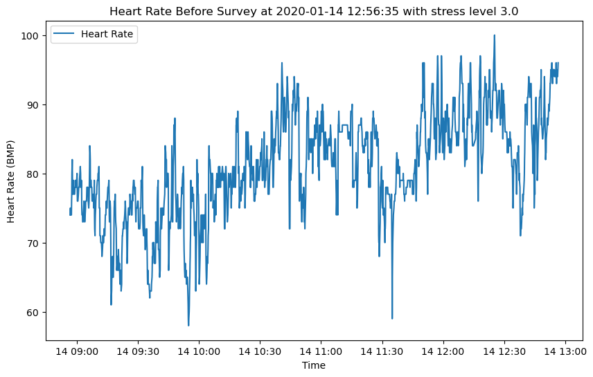
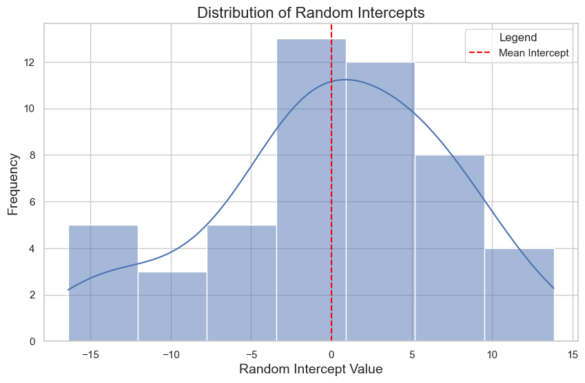

## 📌 Project Overview  
This project investigates the relationship between **heart rate data collected via Fitbit Charge 3** and **self-reported stress levels** among intensive care unit (ICU) residents. The study aimed to assess whether wearable data could provide reliable insights into stress in high-pressure clinical environments.  

- **Population:** 57 ICU residents  
- **Duration:** 3 weeks  
- **Device:** Fitbit Charge 3  
- **Data collected:** Continuous HR, steps, sleep metrics + daily stress surveys (midday and end-of-day)  
- **Methods:** Spearman correlation, paired t-tests, point-biserial correlation, mixed-effects models, and Explainable boosting machine
  
---

## 🧠 Background & Motivation  
ICU residents face high levels of occupational stress and burnout, which negatively impacts well-being and patient care. While wearables have potential for continuous stress monitoring, their reliability in real-world clinical environments remains underexplored.  

This study contributes by analyzing long-term HR data in naturalistic ICU settings and aligning it with self-reported stress levels and stressors.

---

## 📊 Dataset & Preprocessing  
- **Source dataset:** [TILES-2019 dataset](https://doi.org/10.1038/s41597-022-01636-4)  
- **Preprocessing steps:**  
  - Removed empty files & duplicates  
  - Min-max normalization of HR  
  - Aligned HR with survey timestamps  
  - Extracted 4-hour HR segments prior to each survey (midday & evening)  

📈 Example visualization:  

  
   
  <em>Figure 1. Raw heart rate before midday (stress=3.0) and evening (stress=2.0) surveys.</em>

  
   
  <em>Figure 2. Comparison of heart rate patterns between midday and end-of-day surveys for one participant.</em>

---

## 🔬 Analysis & Methods  

### Stage 1: Correlation Analysis  
- Explored relationships between HR metrics (mean, min, median, SD, percentile-based medians, peak HR) and self-reported stress.  
- Found **weak but significant correlations** for lower HR percentiles with stress.  

Table 1. Correlation coefficients between heart rate metrics and stress levels
| Heart rate metrics                  | Coefficient | P value |
| ----------------------------------- | ----------- | ------- |
| Mean heart rate                     | 0.1401      | <.001   |
| Minimum heart rate                  | 0.1068      | <.001   |
| Normalized mean heart rate          | 0.0609      | .02     |
| Normalized median heart rate        | 0.0639      | .11     |
| Ratio of heart rate above 100 (bpm) | 0.0289      | .28     |
| Maximum heart rate                  | 0.0237      | .37     |
| SD of heart rate                    | -0.1036     | <.001   |

Table 2. Correlation between upper percentiles of median heart rate and stress levels
| Heart rate percentiles    | Correlation coefficient | P value |
| ------------------------- | ----------------------- | ------- |
| Top 5% median heart rate  | 0.0227                  | .39     |
| Top 10% median heart rate | 0.0248                  | .35     |
| Top 25% median heart rate | 0.0239                  | .37     |
| Top 50% median heart rate | 0.0297                  | .26     |

Table 3. Correlation between lower percentiles of median heart rate and stress levels
| Heart rate percentiles       | Correlation coefficient | P value |
| ---------------------------- | ----------------------- | ------- |
| Bottom 5% median heart rate  | 0.1066                  | <.001   |
| Bottom 10% median heart rate | 0.1083                  | <.001   |
| Bottom 25% median heart rate | 0.1046                  | <.001   |
| Bottom 50% median heart rate | 0.0967                  | .002    |

---

### Stage 2: Stressor Analysis  
- Compared stress differences between midday and evening surveys using paired t-tests.  
- Identified **daily stressors** (self-care, partner conflict, household tasks, health issues).  
- "Other health" stressors (someone else’s health) showed strongest positive correlation with stress change.  

Table 4. Correlations between daily stressors and stress level changes
| Daily stressor | Coefficient | P value |
| -------------- | ----------- | ------- |
| Partner        | -0.0756     | .0504   |
| Family         | 0.0996      | .009    |
| Breakdown      | -0.0741     | .055    |
| Money          | 0.0062      | .87     |
| Self-care      | -0.0330     | .39     |
| Health         | 0.0098      | .80     |
| Other health   | 0.1694      | <.001   |
| Household      | -0.0386     | .32     |
| Child          | N/A         | N/A     |
| Discrimination | 0.0391      | .31     |
| None           | -0.1085     | .005    |

---

### Stage 3: Mixed-Effects Modeling  
- Accounted for repeated measures with random intercepts per participant.  
- Found **significant association** between self-reported stress and HR (p=0.03).  
- Highlighted **inter-individual variability** in baseline HR and stress responses.  

  
   
  <em>Distribution of random intercepts showing variability in baseline HR.</em>

---

## ✅ Key Findings  
- HR alone is a **modest indicator of stress** in ICU environments.  
- Lower HR percentiles capture stress correlations better than upper percentiles.  
- Daily stressors, particularly health-related ones, influenced stress more than HR.  
- Mixed-effects modeling demonstrated **significant but individualized associations** between stress and HR.  

---

## 📌 Takeaways  
- **Wearables show promise** but should be combined with self-reports and other physiological markers (e.g., HRV, cortisol).  
- **Personalized modeling** is critical due to high inter-individual variability.  
- This study advances the case for **multimodal stress monitoring systems** in healthcare professionals.  

---
